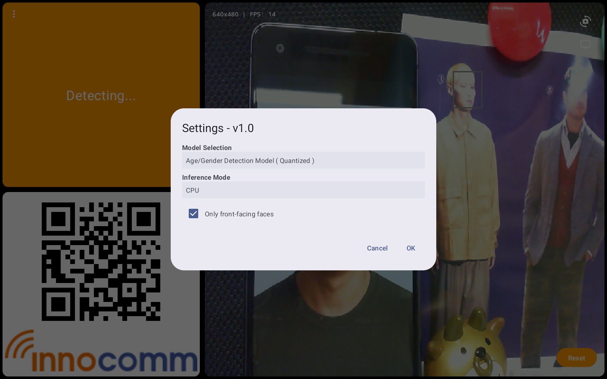
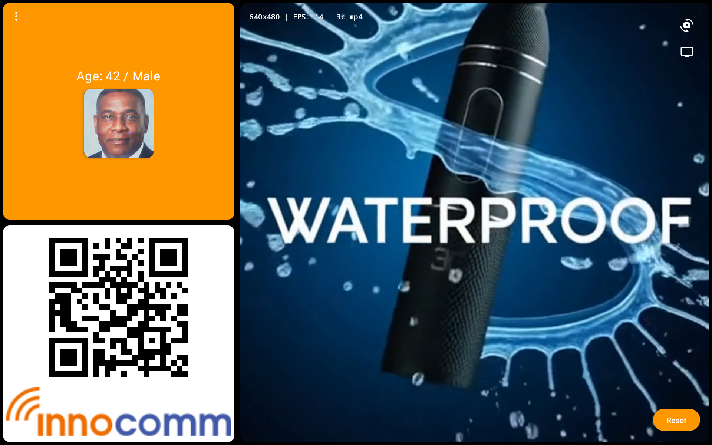
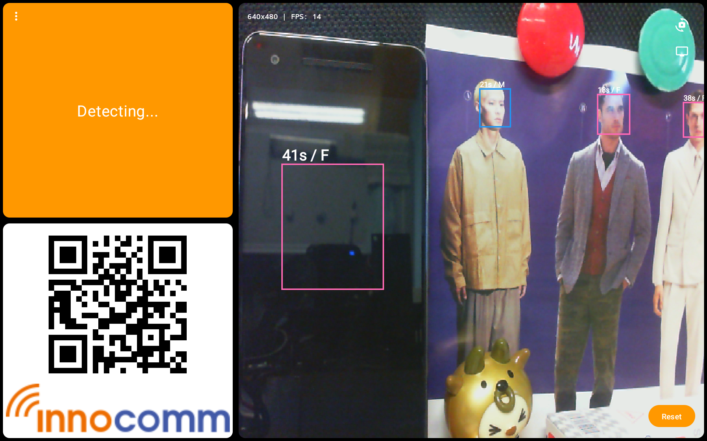

# AI-Driven Age & Gender Estimation System (Android)

<div align="center">
  
  
  
  
</div>

---

## 📖 Overview

This application is a specialized **Demographic-Targeted Content Delivery System** built for Android. It uses real-time computer vision to estimate the age and gender of individuals and automatically triggers targeted video content on an external display. 

Designed for digital signage, smart kiosks, and interactive retail environments, it provides a seamless split-screen experience between the operator (phone) and the audience (HDMI display).


*Real-time face detection and demographic analysis in action*

---

## 🌟 Key Features

### 1. Real-Time Demographic Analysis
* **AI Inference**: Powered by TensorFlow Lite models for high-speed age estimation and gender classification.
* **Face Detection**: Uses Google MLKit for robust face localization.
* **Tracking**: Implements a persistent face tracking system with unique IDs to maintain consistency across frames.

### 2. Dual-Camera Flexibility
* **Built-in Support**: Toggle between Front and Back internal cameras.
* **UVC/USB Support**: Integrated with `libausbc` to support external USB webcams, providing higher flexibility for kiosk mounting.
* **Auto-Detection**: Real-time monitoring of USB device connection/disconnection.


*Flexible camera selection and AI inference settings*

### 3. HDMI Presentation Mode
* **Dual-UI Experience**: 
    * **Operator View (Phone)**: Shows live camera streams, real-time diagnostic overlays (bounding boxes, FPS, AI data), and hardware monitors.
    * **Presentation View (External HDMI)**: A clean, distraction-free interface featuring full-screen targeted videos, promotional QR codes, and snapshots of current visitors.
* **Automatic Layout Scaling**: UI elements adapt based on whether the casting mode is active.



*Left: HDMI Presentation View | Right: Targeted Video Content*

### 4. Smart Video Trigger Logic
The system features an intelligent decision-making engine to ensure the right content reaches the right audience without flickering or false triggers.

---

## 🎬 How Video Playback Works

The playback engine (managed in `FaceDetectionViewModel`) follows a strict priority and validation workflow:

1. **Locking Phase**: A person is "locked" only after a successful AI inference for both age and gender has been completed.
2. **Persistence Rule**: The person must remain in the field of view for at least **1 second** (`VIDEO_PLAY_DELAY`) before playback starts.
3. **Largest Face Priority**: In a crowded environment, the system automatically selects the **largest face** (closest to the camera) as the primary target.
4. **Activity Window**: If the current person leaves, the system clears the trigger after 1 second of inactivity, ready to pick up the next "Best Face."
5. **Content Mapping**: 
    * **Age Ranges**: Teenager (0-18), Middle-Aged (19-49), Elderly (50+).
    * **Gender**: Male / Female.
    * **Randomization**: Pulls from a curated pool of videos to prevent repetition.

---

## 🛠 Tech Stack

* **UI**: Jetpack Compose (Modern declarative UI)
* **AI**: TensorFlow Lite & Google MLKit Face Detection
* **Hardware Interaction**: `libausbc` (UVC Camera support)
* **Video Playback**: Android Media3 (ExoPlayer)
* **Asynchrony**: Kotlin Coroutines & Flow
* **Hardware Monitoring**: Custom Linux sensor parsing for thermal/load data

---

## 🚀 Getting Started

### Prerequisites
* Android Studio (Latest Version)
* Hand-held device running Android 7.0 (API 24) or higher
* (Optional) External USB Camera & HDMI Converter for Presentation Mode

### Installation
1. Clone the repository.
2. Ensure you have the `.tflite` models in the `app/src/main/assets` directory.
3. Build and run the `debug` APK.
4. Grant the necessary **Camera** permissions.

### Build Configuration
Before building, ensure your environment variables are set (example for Linux):
```bash
export JAVA_HOME=/path/to/android-studio/jbr
./gradlew assembleDebug
```

---

## 📄 License

This project is licensed under the MIT License - see the LICENSE file for details.

### AI Models License
The AI models included in the `assets` directory (Age/Gender Estimation) are provided for **non-commercial research and educational use**. 

Please be aware that these models are typically trained on public datasets (like IMDB-WIKI or UTKFace). Users are responsible for ensuring compliance with local privacy laws regarding biometric data processing.

---

<div align="center">
  Developed by <b>InnoComm</b><br>
  Maintained by <b>Mori Lin</b>
</div>
